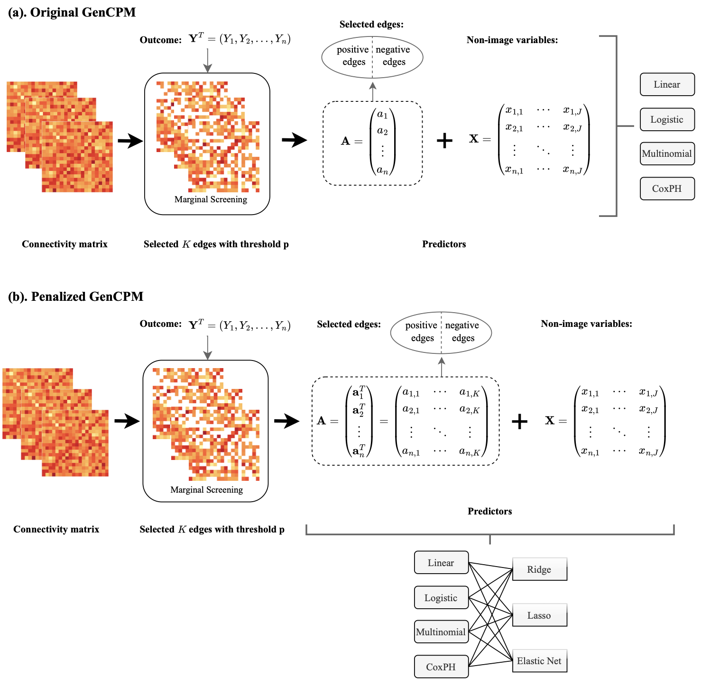
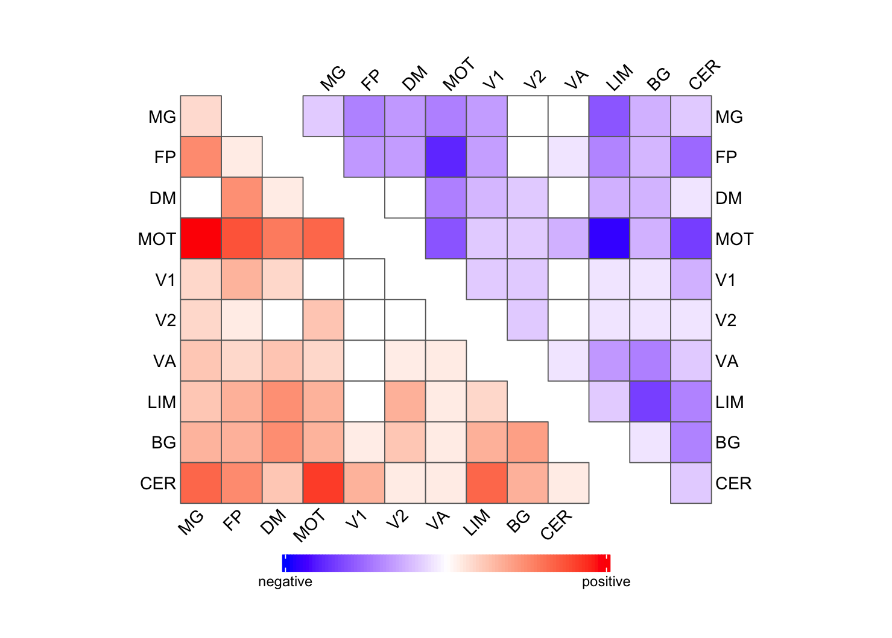

# GenCPM

## Framework




## Installation

You can install GenCPM from github with:

```r
library(devtools)
install_github("BXU69/GenCPM")
library(GenCPM)
```

## Tutorial

### 1. `train.GenCPM`

The `train.GenCPM` is an intermediate function for training models that will be put into `linear.GenCPM`, `logit.GenCPM`, and `multinom.GenCPM`, and doesn't directly output predictions using test data, so we don't use it to make any prediction. 

### 2. `.GenCPM`

The `linear.GenCPM`, `logit.GenCPM`, `multinom.GenCPM`, and `cox.GenCPM` are four main functions to fit models and output predictions for respectively continuous, binary, categorical, and survival responses using Connectome-based Predicted Modeling.

```
linear.GenCPM(
    connectome, behavior, x=NULL, 
    cv="leave-one-out", k = dim(connectome)[3], 
    thresh = .01, edge = "separate", seed = 1220
)
```

```
logit.GenCPM(
    connectome, behavior, x=NULL, 
    cv="leave-one-out", k = dim(connectome)[3], 
    thresh = .01, edge = "separate", seed = 1220
)
```

```
multinom.GenCPM(
    connectome, behavior, x=NULL, 
    cv="leave-one-out", k = dim(connectome)[3], 
    thresh = .01, edge = "separate", seed = 1220
)
```

### Arguments

- `connectome`: an array indicating the connectivity between M edges and over N subjects. The dimension should be `M*M*N`.
- `behavior`: a vector containing the behavior measure for all subjects.
- `x`: a data frame containing the non-image variables in the model.
- `cv`: a character indicating the method of cross-validation. The default method is `"leave-one-out"`.
- `k`: a parameter used to set the number of folds for k-fold cross-validation.
- `thresh`: the value of the threshold for selecting significantly related edges. The default value is `.01`.
- `edge`: a character indicating the model is fitted with either positive and negative edges respectively or combined edges together. The default is `"separate"`.
- `seed`: the value used to set seed for random sampling in the process of cross-validation. The default value is `1220`.

### Output

The functions will return a list containing the following output:

- `positive_edges`: all selected edges having a significantly positive relationship with behavior response.
- `negative_edges`: all selected edges having a significantly negative relationship with behavior response.
- `r_mat`: a list of matrices consisting of Pearson correlation coefficient between edges and behavior.
- `p_mat`: a list of matrices consisting p-value from Pearson correlation between edges and behavior.
- `positive_predicted_behavior`: predicted behaviors from the model fitted using positive edges separately. Not applicable when the argument `edge = "combined"`.
- `negative_predicted_behavior`: predicted behaviors from the model fitted using negative edges separately. Not applicable when the argument `edge = "combined"`.
- `predicted_behavior`: predicted behaviors from the model fitted using all edges. Not applicable when the argument `edge = "separate"`.
- `actual_behavior`: actual values of behavior response.


```
cox.GenCPM(
    connectome, x=NULL, time, status,
    cv="leave-one-out", k = dim(connectome)[3], 
    thresh = .01, edge="separate", seed = 1220
)
```

### Arguments

- `connectome`: an array indicating the connectivity between M edges and over N subjects. The dimension should be `M*M*N`.
- `x`: a data frame containing the non-image variables in the model.
- `time`: the follow-up time for all individuals.
- `status`: the status indicator, normally 0=alive and 1=event.
- `cv`: a character indicating the method of cross-validation. The default method is `"leave-one-out"`.
- `k`: a parameter used to set the number of folds for k-fold cross-validation.
- `thresh`: the value of the threshold for selecting significantly related edges. The default value is `.01`.
- `edge`: a character indicating the model is fitted with either positive and negative edges respectively or combined edges together. The default is `separate`.
- `seed`: the value used to set seed for random sampling in the process of cross-validation. The default value is `1220`.

### Output

- `positive_edges`: all selected edges having a significantly positive relationship with survival outcome in a marginal test.
- `negative_edges`: all selected edges having a significantly negative relationship with survival outcome in a marginal test.
- `positive_predicted_linear_predictor`: predicted linear predictors from the Cox model fitted using positive edges separately. Not applicable when the argument `edge = "combined"`.
- `negative_predicted_linear_predictor`: predicted linear predictors from the Cox model fitted using negative edges separately. Not applicable when the argument `edge = "combined"`.
- `predicted_linear_predictor`: predicted linear predictors from the Cox model fitted using all edges. Not applicable when the argument `edge = "separate"`.
- `actual_status`: actual values of status indicator.
- `actual_time`: actual values of survival time.


### 3. `.regularized.GenCPM`

The `linear.regularized.GenCPM`, `logit.regularized.GenCPM`, `multinom.regularized.GenCPM`, and `cox.regularized.GenCPM` are four penalized-version functions of four `.GenCPM` functions by introducing LASSO, ridge, or elastic-net regularization.


```
linear.regularized.GenCPM(
    connectome, behavior, x, 
    cv="leave-one-out", k=dim(connectome)[3], thresh=.01, 
    edge="separate", type="lasso", lambda=NULL, alpha=NULL, seed=1220
)
```


```
logit.regularized.GenCPM(
    connectome, behavior, x, 
    cv="leave-one-out", k=dim(connectome)[3], thresh=.01, 
    edge="separate", type="lasso", lambda=NULL, alpha=NULL, seed=1220
)
```


```
multinom.regularized.GenCPM(
    connectome, behavior, x, 
    cv="leave-one-out", k = dim(connectome)[3], thresh = .01, 
    edge = "separate", type="lasso", lambda=NULL, alpha=NULL, seed = 1220
)
```

### Arguments
- `connectome`: an array indicating the connectivity between M edges and over N subjects. The dimension should be `M*M*N`.
- `behavior`: a vector containing the behavior measure for all subjects.
- `x`: a data frame containing the non-image variables in the model.
- `cv`: a character indicating the method of cross-validation. The default method is `"leave-one-out"`.
- `k`: a parameter used to set the number of folds for k-fold cross-validation.
- `thresh`: the value of the threshold for selecting significantly related edges. The default value is `.01`.
- `edge`: a character indicating the model is fitted with either positive and negative edges respectively or combined edges together. The default is `"separate"`.
- `type`: type of penalty. The default is `"lasso"`.
- `lambda`: the value of penalty.
- `alpha`: the alpha for elastic net penalty.
- `seed`: the value used to set seed for random sampling in the process of cross-validation. The default value is `1220`.

### Output

- `positive_edges`: all selected edges having a significantly positive relationship with behavior response.                   
- `negative_edges`: all selected edges having a significantly negative relationship with behavior response.
- `positive_predicted_behavior`: predicted behaviors from the model fitted using positive edges separately. Not applicable when the argument `edge = "combined"`.
- `negative_predicted_behavior`: predicted behaviors from the model fitted using negative edges separately. Not applicable when the argument `edge = "combined"`.
- `predicted_behavior`: predicted behaviors from the model fitted using all edges. Not applicable when the argument `edge = "separate"`.
- `actual_behavior`: actual values of behavior response.
- `positive_lambda_total`: the final lambda indicating penalty used in the model fitted with positive edges separately for each fold during cross-validation. Not applicable when `edge = "combined`.
- `negative_lambda_total`: the final lambda indicating penalty used in the model fitted with negative edges separately for each fold during cross-validation. Not applicable when `edge = "combined`.
- `lambda_total`: the final lambda indicating penalty used in the model fitted with all edges for each fold during cross-validation. Not applicable when `edge = "separate"`.


```
cox.regularized.GenCPM(
    connectome, x=NULL, time, status,
    cv="leave-one-out", k = dim(connectome)[3], thresh = .01, 
    edge="separate", type="lasso", lambda=NULL, alpha=NULL, seed = 1220
)
```

### Arguments

- `connectome`: an array indicating the connectivity between M edges and over N subjects. The dimension should be `M*M*N`.
- `x`: a data frame containing the non-image variables in the model.
- `time`: the follow-up time for all individuals.
- `status`: the status indicator, normally 0=alive and 1=event.
- `cv`: a character indicating the method of cross-validation. The default method is `"leave-one-out"`.
- `k`: a parameter used to set the number of folds for k-fold cross-validation.
- `thresh`: the value of the threshold for selecting significantly related edges. The default value is `.01`.
- `edge`: a character indicating the model is fitted with either positive and negative edges respectively or combined edges together. The default is `"separate"`.
- `type`: type of penalty. The default is `"lasso"`.
- `lambda`: the value of penalty.
- `alpha`: the alpha for elastic net penalty.
- `seed`: the value used to set seed for random sampling in the process of cross-validation. The default value is `1220`.


### Output

- `positive_edges`: all selected edges having a significantly positive relationship with survival outcome in a marginal test.
- `negative_edges`: all selected edges having a significantly negative relationship with survival outcome in a marginal test.
- `positive_predicted_linear_predictor`: predicted linear predictor from the model fitted using positive edges separately. Not applicable when the argument `edge = "combined"`.
- `negative_predicted_linear_predictor`: predicted linear predictor from the model fitted using negative edges separately. Not applicable when the argument `edge = "combined"`.
- `predicted_linear_predictor`: predicted linear predictor from the model fitted using all edges. Not applicable when the argument `edge = "separate"`.
- `actual_status`: actual values of status indicator.
- `actual_time`: actual values of survival time.
- `positive_lambda_total`: the final lambda indicating penalty used in the model fitted with positive edges separately for each fold during cross-validation. Not applicable when `edge = "combined`.
- `negative_lambda_total`: the final lambda indicating penalty used in the model fitted with negative edges separately for each fold during cross-validation. Not applicable when `edge = "combined`.
- `lambda_total`: the final lambda indicating penalty used in the model fitted with all edges for each fold during cross-validation. Not applicable when `edge = "separate"`.


### 4. `assess.GenCPM`

The `assess.GenCPM` is the function to assess the model performance across testing folds with varying types of metrics based on the specific model type.

```
assess.GenCPM(
    object, model="linear", edge="separate"
)
```

### Arguments
- `object`: returned GenCPM object from `.GenCPM` or `.regularized.GenCPM` functions. 
- `model`: a character string representing one of the built-in regression models. `"linear"` for `linear.GenCPM` and `linear.regularized.GenCPM`; `"logistic"` for `logit.GenCPM` and `logit.regularized.GenCPM`; "multinom"" for `multinom.GenCPM` and `multinom.regularized.GenCPM`; and `"cox"` for `cox.GenCPM` and `cox.regularized.GenCPM`. The default is `"linear"`.
- `edge`: usage of edges to fit models, and it should be decided by the edge usage in the `"object"` input. `"seperate"` for fitting two separate models using positive edges and negative edges respectively, and `"combined"` for fitting only one model use all edges selected. The default is `"separate"`. The function will report error if the `edge` is not correctly specified.

### Output

The output of `assess.GenCPM` is a list contains metrics assessing the model performance (MSE, AUC, multi-class AUC, and C-index, based on the specific model type), predicted response and actual response.


### 5. `heatmap.GenCPM`

The `heatmap.GenCPM` is the function to visualize the slected edges either from thresholding or regularization based on the 10-node network label in Shen268 atlas.

```
heatmap.GenCPM(
    cpm, foldThreshold = .5
)
```

### Arguments

- `cpm`: returned GenCPM object from `.GenCPM` or `.regularized.GenCPM` functions. 
- `foldThreshold`: the edges selected for over this many folds will be plotted. If set to .5, the edges selected at least half of the time are plotted.  


### Output

The output of `heatmap.GenCPM` is a heatmap demonstrating the strength of the correlation between connectivity and response by the shade of the color, with red representing a positive correlation and blue representing a negative correlation.


## Example

We generate simulation data as the input data to illustrate how to use some functions of this package. The following example is the tutorial of the `linear.GenCPM`. The usage of other model fitting functions is the same case.

First, we generate `connectome`, which is a `268*268*500` array, and the behavior response `y` as follows. 268 is the preference dimension as the heatmap plotting selected edges uses 10-node label from Shen268 atlas. 

```r
set.seed(123)
N <- 500 # 500 individuals
M <- 268 # 268 edges
connectome <- array(0, dim = c(M, M, N)) # initialize the 3D array to store the connectivity matrix
edge <- matrix(NA, nrow = N, ncol = (M+1)*M/2) # to store the upper-triangle part of the matrix
  
index <- c(1:((M+1)*M/2)) 
pos_ind <- sample(index, ((M+1)*M/2)/3, replace = F) # randomly sample 1/3 edges to be positively correlated with the response
neg_ind <- sample(index[-pos_ind], ((M+1)*M/2)/3, replace = F) # randomly sample 1/3 edges to be negative correlated with the response

for (i in 1:N) {
  
  mat <- matrix(runif(M*M, min = -1, max = 1), nrow = M) # generate random connectivity matrix
  sym_mat <- (mat + t(mat)) / 2   # make the matrix symmetric
  diag(sym_mat) <- 1   # set the diagonal to 1
  connectome[, , i] <- sym_mat
  edge[i,] <- sym_mat[upper.tri(sym_mat, diag=T)]
  
}

corr <- rep(0, (M+1)*M/2) # set correlation to be 0 for those edges not be selected
corr[pos_ind] <- 0.8 # set correlation to be 0.8 for those edges selected to be positive
corr[neg_ind] <- -0.8 # set correlation to be 0.8 for those edges selected to be negative
epsilon <- rnorm(N) # generate error term
y <- edge %*% corr + epsilon # generate response `y`
```

Then, the simulation data are put into the `linear.GenCPM` to fit a linear regression model and make the prediction. We don't include non-image covariate `x` in this example and keep other settings as default.

```r
lm.fit <- linear.GenCPM(connectome, y)
```

The next step you may want to do is to assess the prediction by the `assess.GenCPM`.

```r
assess.GenCPM(lm.fit, model = "linear", edge = "separate")
```

Pay attention that you should specify the `edge` correctly, which is decided by the model you fitted with `linear.GenCPM`, otherwise it will report error. Also, remember to change the parameter `model` when switching to fit a logistic, multinomial logistic, or Cox model.

Finally, we can visualize the significant edges identified by `GenCPM` in a heatmap.

```r
heatmap.GenCPM(lm.fit, foldThreshold = 0.8)
```

`foldThreshold = 0.8` means that the edges selected for over 80% folds will be plotted. You can tune this parameter according to your need.




## Citation

Please cite the paper when you use the `GenCPM` package.


